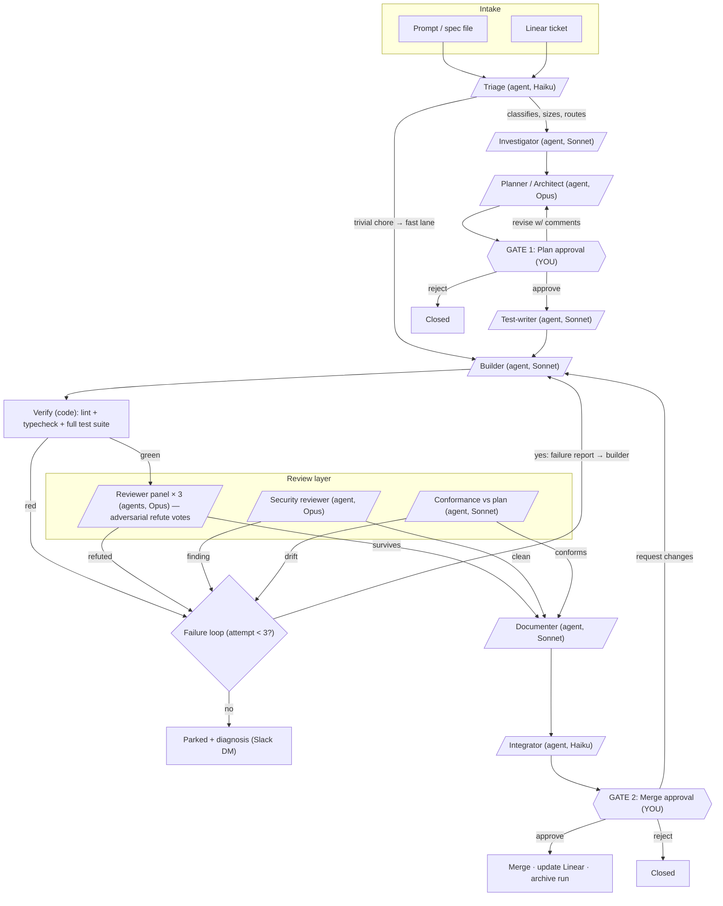

# My Factory — Architecture & Design

**Status:** Design locked (v1). Phase 0 (skeleton) built and smoke-tested 2026-08-11 — see §14; `scripts/smoke-test.sh` is the standing acceptance test.
**Owner:** Matt Conrad
**Date:** 2026-08-11

A software factory: a graph of nodes — human gates, deterministic code, and specialized agents — that takes a work item (a prompt, a spec, or a Linear ticket) and turns it into a merged, tested, reviewed, documented change in a target repository.

---

## 1. Design decisions (from the interview)

| Decision | Choice |
|---|---|
| Target scope | Existing repos in v1; architecture leaves a greenfield "bootstrap" door open (§13) |
| Intake | Typed prompt/spec + Linear tickets |
| Human gates | Plan approval + merge approval (plus escalation on repeated failure) |
| Runtime | Hybrid: interactive Claude Code for gates and orchestration; deterministic scripts for verification machinery |
| Agent roster | Triage, Investigator, Planner, Test-writer, Builder, Reviewer panel (adversarial), Security reviewer, Conformance checker, Documenter, Integrator |
| Definition of done | Full suite + lint green · new tests for the change · adversarial review survives · plan-conformance passes |
| Concurrency | Serial (one item at a time) in v1; parallel via git worktrees is a designed-for extension (§13) |
| Failure policy | Bounded retry (default 3 build attempts), then park + escalate with diagnosis |
| Notifications | Slack DM at every human gate and escalation |
| Model mix | Tiered by judgment (§11) |

Decisions I made on your behalf (veto any of these): file-based state in `runs/`, YAML per-repo configs, the specific state machine in §7, the review-vote protocol in §5, and the metrics schema in §12.

---

## 2. The graph



Three node types:

- **Human nodes** (2 gates + escalation): the pipeline *blocks* and pings you on Slack. Nothing proceeds without your decision.
- **Code nodes** (verify, state transitions, notifications): deterministic scripts. No model calls, no judgment, perfectly repeatable.
- **Agent nodes** (10): each is a fresh-context subagent with a written role definition, explicit inputs, and a structured output contract.

---

## 3. Node specifications

Every agent node follows the same contract: **fresh context per invocation** (no accumulated conversation sludge), inputs read from the run directory, output written as a file to the run directory, structured (frontmatter or JSON) so the next node and the state machine can consume it.

### 3.1 Triage — `Haiku`
- **In:** raw spec / Linear ticket body + per-repo config.
- **Out:** `item.yaml` fields: `type` (bug/feature/chore/refactor), `size` (XS–L), `repo`, `risk`, `route`.
- **Routing:** XS chores (typo, dep bump, config tweak) take the **fast lane**: skip Investigator and Planner, go straight to Builder with a 1-reviewer vote and no Gate 1. Everything else takes the full pipeline. Anything sized L gets a note suggesting you split it before it enters.

### 3.2 Investigator — `Sonnet`
- **In:** spec, repo access (read-only).
- **Out:** `investigation.md` — reproduction steps (for bugs), relevant files with line refs, existing patterns to follow, blast radius, prior art in git history, open questions.
- **Rule:** the Investigator never proposes solutions. It establishes ground truth. This keeps the Planner honest — plans built on verified facts, not first impressions.

### 3.3 Planner / Architect — `Opus`
- **In:** spec + `investigation.md` + repo conventions (CLAUDE.md, per-repo config).
- **Out:** `plan.md` — numbered steps, files to touch, interfaces/signatures, **test strategy** (what the Test-writer will write), risks and rollback, explicit **out-of-scope** list, and a draft ADR when an architectural choice is made.
- The out-of-scope list is load-bearing: it's what the Conformance checker uses to catch scope creep.

### 3.4 GATE 1 — Plan approval — `YOU`
See §4 for the gate protocol.

### 3.5 Test-writer — `Sonnet`
- **In:** approved `plan.md` (test strategy section) + repo.
- **Out:** failing tests committed to the work branch, plus `tests-manifest.md` listing each test and the plan requirement it proves.
- **Why separate from the Builder:** an agent that writes both implementation and tests tends to write tests that bless its own bugs. Independent test authorship means the tests encode the *plan's* intent, not the implementation's behavior. Tests must **fail before build** (red first) — a test that passes before the change is vacuous and gets rejected here.

### 3.6 Builder — `Sonnet`
- **In:** approved plan + failing tests + (on retries) the failure report.
- **Out:** implementation on the work branch. Done = the new tests pass locally.
- **Constraints:** may not modify test assertions (test *fixtures/scaffolding* fixes require a note that the Reviewer panel checks); must stay inside the plan's file list or record a justified deviation in `deviations.md`.

### 3.7 Verify — `code, no model`
- Runs the per-repo config's commands: lint, typecheck, full test suite. One script, `scripts/verify.sh <repo>`, exits 0 or writes a structured `failure-report.md` (what failed, output excerpt, suspected area). Red → failure loop (§6). Green → review layer.

### 3.8 Reviewer panel — `3 × Opus, parallel`
- **In:** diff + plan + tests-manifest. Each reviewer gets a distinct lens: **correctness**, **maintainability/design**, **tests-actually-test-it**.
- **Protocol:** each reviewer's job is to **refute** — produce a concrete failure scenario (inputs/state → wrong behavior), not style opinions. A refutation must be specific enough to turn into a failing test.
  - Any reviewer with a *confirmed, concrete* refutation → failure loop, and their scenario becomes a new test case first.
  - Style/design comments that don't refute correctness accumulate into the PR description as non-blocking notes.
- **Why adversarial:** agreeable review is worthless. "Try to break this" catches plausible-but-wrong code that "does this look good?" waves through.

### 3.9 Security reviewer — `Opus`
- **In:** diff + dependency changes.
- **Out:** findings (injection, authz gaps, secret handling, unsafe deps, data exposure) or a clean pass. Findings are blocking → failure loop.
- Runs in parallel with the reviewer panel.

### 3.10 Conformance checker — `Sonnet`
- **In:** diff + **approved** plan (including its out-of-scope list).
- **Out:** verdict — every plan item present? anything out-of-scope present? deviations justified in `deviations.md`?
- **Why it exists:** Gate 1 is only worth your time if the thing you approved is the thing that ships. This node guards that investment. Drift → failure loop (or, if the deviation looks *right*, it escalates to you rather than bouncing to the Builder).

### 3.11 Documenter — `Sonnet`
- **In:** the entire run directory.
- **Out (four artifacts):**
  1. `report.md` — the run report: what was asked, found, planned, changed, every gate result, attempts, tokens. Your audit trail and the factory's memory.
  2. **PR description + changelog entry** — human-facing.
  3. **CLAUDE.md deltas** for the target repo — anything learned this run that makes every future run smarter (a gotcha, a convention, a command). Compounding returns; this is the factory's flywheel.
  4. **ADR finalization** — if the Planner drafted one, it's polished and placed in the repo's `docs/adr/`.

### 3.12 Integrator — `Haiku`
- **In:** finished branch + PR description.
- **Out:** clean commit history, pushed branch, opened PR, CI status watched, Linear ticket updated with the PR link. After Gate 2 approval: merge, close ticket, archive run.
- Pure git/GitHub/Linear mechanics — no code judgment, hence the cheap model.

### 3.13 GATE 2 — Merge approval — `YOU`
See §4.

---

## 4. Human gate protocol

Both gates work the same way:

1. Pipeline reaches the gate → state file updates to `AWAITING_*` → **Slack DM** with: item id, one-paragraph summary, what to review (`plan.md` or the PR link), and the three verbs.
2. You respond in the factory session (or a fresh one — state is on disk, any session can pick it up):
   - **approve** — pipeline continues.
   - **revise: <comments>** — Gate 1: comments go to the Planner for a new plan revision. Gate 2: comments go to the Builder as a failure report (one bonus attempt that doesn't count against the retry budget, since it's new information).
   - **reject: <reason>** — item closes, run archives with the reason, Linear ticket updated.
3. Gate decisions are recorded in `item.yaml` with timestamp and your comments — part of the audit trail and the metrics (§12).

**Escalation is a third, implicit gate:** when the failure loop exhausts its budget, the item parks. The Documenter writes a diagnosis (what was tried, why each attempt failed, its best hypothesis), and you get a Slack DM. Your options: retry with guidance, re-plan, take it manually, or kill it.

---

## 5. Quality layer — what "done" means

Four independent layers, cheapest first, so expensive checks never run on work that fails cheap ones:

| # | Layer | Kind | Catches |
|---|---|---|---|
| 1 | Lint + typecheck + full suite | code | Regressions, breakage, style drift |
| 2 | New tests (red-first, independent author) | agent+code | "It compiles but doesn't do the thing" |
| 3 | Adversarial review panel + security pass | agents | Plausible-but-wrong logic, edge cases, vulns |
| 4 | Plan conformance | agent | Scope creep, silent omissions, drift from what you approved |

Order of execution: 1 → (2 was authored pre-build, enforced by 1) → 3 and 4 in parallel.

A refutation from layer 3 must be converted into a failing test before the Builder retries — so every review catch permanently hardens the suite. The factory's test suites get stronger as a side effect of its own mistakes.

---

## 6. Failure loops & escalation

```
verify red / review refuted / security finding / conformance drift
        │
        ▼
  failure-report.md (structured: what, evidence, suspected cause)
        │
        ▼
  attempts.build < 3?  ──yes──▶  Builder retries (fresh context: plan + diff + failure report)
        │ no
        ▼
  PARKED → Documenter writes diagnosis → Slack DM → you decide
```

- **Fresh context per retry.** The Builder never sees its own previous flailing — only the plan, the current diff, and a clean failure report. Accumulated failure context makes agents worse, not better.
- **Budget:** 3 build attempts default (per-repo configurable). Plan revisions at Gate 1 are separately budgeted (2, then it's a conversation).
- **Distinct failure sources share the budget** — three different one-off failures and three failures of the same kind both mean something is wrong enough for a human.

---

## 7. State model & directory layout

All state is **files on disk** — no database, no daemon. Any Claude session, script, or `cat` can inspect or resume a run. The factory repo:

```
my-factory/
├── DESIGN.md                  # this document
├── factory.config.yaml        # global: model tiers, retry budgets, Slack target, defaults
├── repos/
│   └── <name>.yaml            # per-repo: path, verify commands, conventions, guardrails, fast-lane rules
├── agents/                    # one role definition per agent node (10 files)
│   ├── triage.md … integrator.md
├── skills/                    # slash commands (the control surface, §8)
├── scripts/
│   ├── state.sh               # state-machine transitions on item.yaml (the only writer)
│   ├── verify.sh              # runs a repo's lint/typecheck/tests → pass or failure-report.md
│   └── notify.sh              # Slack DM at gates/escalations
├── templates/                 # plan.md, report.md, failure-report.md, ADR skeletons
└── runs/
    ├── 2026-08-11-fix-auth-race/
    │   ├── item.yaml          # the state machine record (single source of truth)
    │   ├── spec.md
    │   ├── investigation.md
    │   ├── plan.md            # + approval note appended
    │   ├── tests-manifest.md
    │   ├── deviations.md
    │   ├── attempts/          # failure-report-1.md, …
    │   ├── review/            # vote-correctness.md, vote-design.md, vote-tests.md, security.md, conformance.md
    │   └── report.md
    └── metrics.jsonl          # one line per completed run (§12)
```

**`item.yaml` state machine:**

```
INTAKE → TRIAGED → INVESTIGATING → PLANNING → AWAITING_PLAN_APPROVAL
       → WRITING_TESTS → BUILDING → VERIFYING → REVIEWING
       → DOCUMENTING → INTEGRATING → AWAITING_MERGE_APPROVAL
       → MERGING → DONE
                                     (any stage) → PARKED → (resume|CLOSED)
```

`item.yaml` carries: id, source (`prompt` | `linear:HAI-123`), repo, type/size/risk, current state, attempt counters, gate decisions with timestamps and comments, token/cost tally. Only `scripts/state.sh` writes state transitions, so transitions are validated and logged in one place.

Work happens on a branch (`factory/<run-id>`) in the target repo — v1 works directly in the repo checkout since it's serial; the run directory holds everything that isn't code.

---

## 8. Runtime mapping (the hybrid)

**Interactive Claude Code = the control room.** You drive with slash commands (project skills in `skills/`):

| Command | Does |
|---|---|
| `/factory new <repo> <spec…>` | Creates a run from a typed spec, kicks off triage → the pipeline runs to Gate 1 |
| `/factory pull <linear-id>` | Imports a Linear ticket as a run |
| `/factory status` | Table of all runs: state, waiting-on, attempts |
| `/factory approve <run> [comments]` / `reject` / `revise` | Gate decisions |
| `/factory resume <run>` | Continues a parked or interrupted run |

**Agent nodes = Claude Code subagents** (`agents/*.md` role definitions), spawned by the orchestrating session with the tiered models. The pipeline between two human gates is one autonomous stretch — the orchestrator chains investigator → planner, then stops; later chains test-writer → … → integrator, then stops.

**Code nodes = `scripts/`**, invoked via Bash. Deterministic, no model.

**Headless (phase 2+):** `claude -p "/factory resume next"` from cron/launchd drains approved work overnight; the same disk state means interactive and headless runs are interchangeable. This is where the hybrid pays off — gates happen when you're at the keyboard, machinery runs when you're not.

---

## 9. Intake paths

**Prompt/spec:** `/factory new` with inline text or a path to a spec file. Triage normalizes it into `spec.md`.

**Linear:** `/factory pull HAI-123` fetches the ticket (title, description, comments, labels) into `spec.md` with a `linear:` source tag. The Integrator posts status transitions back to the ticket (investigating → plan awaiting approval → PR open → merged) and links the PR.
Linear connector verified working (2026-08-11): authenticated as mattconrad, teams FEL, FDEV, HAI. Per-repo config should name the default team/project for tickets the factory files or updates.

---

## 10. Notifications

`scripts/notify.sh` sends a Slack DM to you at exactly three moments: **Gate 1 reached, Gate 2 reached, item parked.** Message = run id, repo, one-paragraph summary, what to look at, verbs available. Nothing else pings you — progress is pull-based via `/factory status`. (Slack sends will need a pre-approved permission pattern in the factory's settings so headless runs don't stall on prompts.)

---

## 11. Model & cost policy

| Tier | Model class | Nodes | Rationale |
|---|---|---|---|
| Judgment | Opus-class | Planner, Reviewer panel ×3, Security reviewer | Errors here are the expensive ones — a bad plan wastes the whole pipeline; a soft review ships bugs |
| Craft | Sonnet-class | Investigator, Test-writer, Builder, Conformance, Documenter | Skilled work inside a clear contract |
| Mechanical | Haiku-class | Triage, Integrator, notifications | Classification and plumbing |

Cost shape per full-pipeline item: roughly 5 Opus calls (1 plan + 3 votes + 1 security), 5–7 Sonnet calls (plus retries), 2 Haiku calls. The fast lane (XS chores) cuts this to ~1 Sonnet + 1 Opus + 2 Haiku. Every run's token tally lands in `item.yaml` and `metrics.jsonl`, so cost-per-change is a tracked number, not a vibe.

---

## 12. The factory improves itself

"Most effective and efficient" is a moving target, so the factory measures itself. Every completed or killed run appends one line to `runs/metrics.jsonl`:

```json
{"run":"…","repo":"…","type":"bug","size":"S","outcome":"merged",
 "attempts":2,"gate1_revisions":1,"caught_by":{"verify":1,"review":1,"security":0,"conformance":0},
 "plan_edit_distance":"minor","wall_hours":3.1,"tokens":…}
```

Periodically (monthly, or via a scheduled skill later), a review pass over the metrics asks:

- **Which quality layer catches things?** A layer that never fires in 20 runs is a candidate to cheapen (3 votes → 1) — or its prompts are too soft.
- **Where do retries cluster?** Retries concentrated after review = Builder prompt or plan template problem. Red verifies on attempt 1 = Test-writer/Builder handoff problem.
- **How much do you edit plans at Gate 1?** High edit distance = Planner prompt needs your patterns folded in.
- Findings become edits to `agents/*.md` and `templates/` — prompt changes are versioned like code.

This plus the Documenter's CLAUDE.md deltas are the two flywheels: repos get easier to work in, and the factory gets better at working.

---

## 13. Designed-for extensions (not in v1)

- **Parallelism:** the run directory + branch-per-run model has no shared mutable state except the repo checkout. Swap "checkout" for "git worktree per run" and N items run concurrently; the gates become a queue. Off in v1 to learn failure modes cheaply.
- **Greenfield bootstrap:** one new entry node — Bootstrap agent takes a spec, generates a repo skeleton + `repos/<name>.yaml` + initial CLAUDE.md, then the standard pipeline takes over from Planner. No pipeline changes.
- **Scheduled self-directed work:** cron-triggered triage that finds its own work items (flaky tests, dep bumps, TODO audits) and queues them for your Gate 1.
- **More reviewers as needed:** performance lens, accessibility lens — the panel is just a list.

---

## 14. Implementation roadmap (future sessions)

**Phase 0 — Skeleton: ✅ done (2026-08-11).** Directory scaffold, `factory.config.yaml`, `repos/_example.yaml` schema, `state.sh` (state machine + gates + park/resume + counters), `verify.sh` (steps from repo config, structured failure reports), `notify.sh` stub, all templates, and `smoke-test.sh` covering the full lifecycle. Implementation note: `item.yaml` uses **flat keys** (`attempts_build`, `gate_plan`) rather than the nested shape sketched in §7, so `state.sh` can edit it with line-oriented tools and no YAML-parser dependency.

**Phase 1 — Walking skeleton: 🟡 built 2026-08-14, awaiting first real run.** Agent contracts for investigator/planner/builder/integrator in `agents/`; the `/factory` orchestrator skill (`new`, `pull`, `add-repo`, `status`, `approve/revise/reject`, `resume`) in `.claude/skills/factory/`; README quickstart. `state.sh` hardened: portable sed (GNU+BSD) and a JSON log line per transition into `runs/factory.log.jsonl` (the future Datadog seam). Phase 1 pass-throughs: WRITING_TESTS (builder writes the plan's tests red-first until the test-writer exists), REVIEWING, DOCUMENTING (orchestrator writes a minimal report). **Remaining:** register the first target repo (`/factory add-repo`) and push one real, small task end to end. *Everything else waits until this works.*

**Phase 2 — Quality organs (1–2 sessions):** test-writer, reviewer panel, security, conformance, failure loops with budgets, Slack notifications, Linear intake (after re-auth).

**Phase 3 — Memory & polish:** documenter full scope (report, CLAUDE.md deltas, changelog, ADRs), `metrics.jsonl`, `/factory status`, headless resume via cron.

**Phase 4 — Extensions:** parallel worktrees, greenfield bootstrap, self-directed scheduled work.

The first real task through Phase 1 should be a genuinely small bug fix in a repo you know well — you're testing the factory, not the task.
